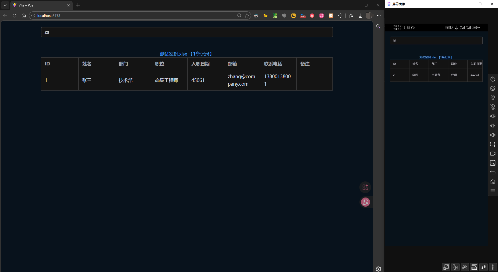

# XLSX Viewer - Excel文件查看器

一个基于 Vue 3 + Vite + Express 的 Excel 文件在线查看工具，支持在多个xlsx文件中进行拼音搜索、表格展示和详情查看功能。



## 功能特性

- 📊 **Excel 文件解析与展示** - 自动读取并解析 Excel 文件，以表格形式展示数据
- 🔍 **智能搜索** - 支持中文、拼音、首字母搜索，支持多音字匹配
- 📱 **响应式设计** - 适配不同屏幕尺寸，提供良好的用户体验
- 🎨 **现代化 UI** - 基于 Element Plus 组件库，界面美观易用
- 📄 **详情查看** - 点击表格可查看完整数据，支持分页显示
- 🚀 **快速加载** - 使用 Vite 构建工具，开发和生产环境都具备极快的启动速度

## 技术栈

### 前端
- **Vue 3** - 渐进式 JavaScript 框架
- **Vite** - 下一代前端构建工具
- **Element Plus** - Vue 3 组件库
- **Pinia** - Vue 状态管理
- **Vue Router** - 官方路由管理器
- **xlsx** - Excel 文件解析库
- **pinyin-pro** - 中文拼音转换库

### 后端
- **Express** - Node.js Web 框架
- **CORS** - 跨域资源共享支持

## 项目结构

```
xlsxView-vite-vue3/
├── src/                          # 前端源代码
│   ├── api.js                    # API 接口配置
│   ├── App.vue                   # 根组件
│   ├── main.js                   # 入口文件
│   ├── router/                   # 路由配置
│   │   └── index.js
│   ├── stores/                   # Pinia 状态管理
│   │   └── counter.js
│   ├── utils/                    # 工具函数
│   │   └── index.js              # 拼音搜索工具
│   ├── views/                    # 页面组件
│   │   └── IndexView.vue        # 主页面
│   └── style.css                # 全局样式
├── autojsPro-project/            # 后端服务目录
│   ├── books/                    # Excel 文件存放目录
│   ├── books.json               # 解析后的 JSON 数据
│   ├── config.js                # 配置文件
│   ├── freshXlsxData.js         # Excel 数据刷新脚本
│   ├── module.server.node.js    # Express 服务器模块
│   ├── server.node.js           # 服务器主文件
│   ├── server-bridge.mjs        # ESM/CJS 桥接文件
│   └── dist/                    # 构建输出目录
├── books/                        # Excel 文件目录（根目录）
├── public/                       # 静态资源
├── vite.config.js               # Vite 配置文件
├── my-vite-config.js            # Vite 自定义配置
└── package.json                 # 项目依赖配置
```

## 安装与运行

### 环境要求

- Node.js >= 14.0.0
- npm 或 yarn

### 安装依赖

```bash
# 安装前端依赖
npm install

# 安装后端依赖
cd autojsPro-project
npm install
cd ..
```

### 准备 Excel 文件

1. 将 Excel 文件（.xlsx 格式）放入 `autojsPro-project/books/` 目录
2. 确保 Excel 文件第一行为表头，且表头不能为空
3. 运行数据刷新脚本生成 JSON 数据：

```bash
cd autojsPro-project
npm run build
# 或者直接运行
node freshXlsxData.js
```

### 启动开发服务器

```bash
# 启动前端开发服务器（端口 5173）
npm run dev

# 在另一个终端启动后端服务器（端口 3000）
cd autojsPro-project
node server.node.js
```

访问 `http://localhost:5173` 即可使用应用。

### 构建生产版本

```bash
# 构建前端
npm run build

# 构建后的文件在 autojsPro-project/dist/ 目录
# 后端服务器会自动提供静态文件服务
```

## API 接口

### GET /books-json
获取所有 Excel 文件数据

**查询参数：**
- `filterKey` (可选) - 搜索关键词，支持中文、拼音、首字母

**响应示例：**
```json
[
  {
    "name": "测试案例.xlsx",
    "header": [
      {"key": 0, "value": "姓名"},
      {"key": 1, "value": "年龄"}
    ],
    "table": [
      ["张三", "20"],
      ["李四", "25"]
    ],
    "mTable": []
  }
]
```

### POST /download
下载 Excel 文件

**请求体：**
```json
{
  "filename": "测试案例.xlsx"
}
```

### GET /books
获取所有 Excel 文件名列表

## 使用说明

1. **搜索功能**
   - 在搜索框输入关键词
   - 支持中文直接搜索
   - 支持拼音搜索（如：输入 "zhangsan" 可搜索到 "张三"）
   - 支持首字母搜索（如：输入 "zs" 可搜索到 "张三"）
   - 支持多音字匹配

2. **查看数据**
   - 主页面显示所有 Excel 文件的预览（最多显示 500 条记录）
   - 点击文件名链接可查看完整数据
   - 在详情页面点击表格行可查看所在页码（如果数据有分页）

3. **数据更新**
   - 添加新的 Excel 文件到 `autojsPro-project/books/` 目录
   - 运行 `freshXlsxData.js` 脚本刷新数据
   - 刷新浏览器页面即可看到新数据

## 配置说明

### Excel 文件格式要求

- 文件格式：`.xlsx`
- 第一行必须为表头，且不能为空
- 表头列名不能为空

### 服务器配置

服务器默认运行在 `3000` 端口，可在 `autojsPro-project/server.node.js` 中修改：

```javascript
server.start(3000) // 修改端口号
```

### Vite 配置

主要配置在 `vite.config.js` 和 `my-vite-config.js` 中：

- 开发服务器端口：5173
- 构建输出目录：`autojsPro-project/dist`
- 支持 Vue 3、CommonJS、Top-level await 等特性

## 开发说明

### 拼音搜索实现

项目使用 `pinyin-pro` 库实现拼音搜索功能，支持：
- 全拼匹配
- 首字母匹配
- 多音字处理
- 模糊匹配

相关代码在 `src/utils/index.js` 和 `autojsPro-project/server.node.js` 中。

### AutoJS Pro 支持

项目支持在 AutoJS Pro 环境中运行，相关配置在 `autojsPro-project/` 目录中。

## 常见问题

### Q: 为什么搜索没有结果？
A: 请检查：
1. Excel 文件是否已正确解析（检查 `books.json` 文件是否存在且内容正确）
2. 搜索关键词是否正确
3. 数据中是否包含匹配的内容

### Q: 如何添加新的 Excel 文件或重新解析数据？
A: 
1. 将文件放入 `autojsPro-project/books/` 目录
2. 运行 `node autojsPro-project/freshXlsxData.js` 刷新数据
3. 重启后端服务器或刷新前端页面

### Q: 构建后如何部署？
A: 
1. 运行 `npm run build` 构建前端
2. 确保 `autojsPro-project/dist/` 目录包含构建文件
3. 启动后端服务器：`node autojsPro-project/server.node.js`
4. 服务器会自动提供静态文件服务

## 依赖说明

### 主要依赖

- **vue** ^3.5.24 - Vue 框架
- **element-plus** ^2.11.7 - UI 组件库
- **xlsx** ^0.18.5 - Excel 解析库
- **pinyin-pro** ^3.27.0 - 拼音转换库
- **express** ^5.1.0 - Web 框架
- **vite** ^7.2.2 - 构建工具

### 开发依赖

- **@vitejs/plugin-vue** ^6.0.1 - Vue 插件
- **sass** ^1.94.0 - CSS 预处理器

完整依赖列表请查看 `package.json` 文件。

## 许可证

本项目采用 **MIT License** 开源协议。
您可以自由地使用、修改和分发本代码，但请保留原始的版权声明。
严禁将本代码用于任何违法、侵权或损害他人利益的行为。

## 作者

勤欣

## 更新日志

### v0.0.0
- 初始版本
- 支持 Excel 文件解析和展示
- 支持拼音搜索功能
- 支持详情查看和分页显示